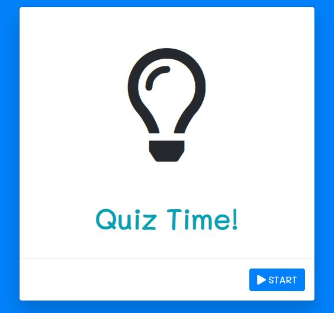
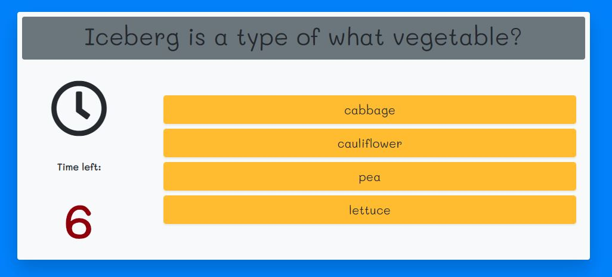
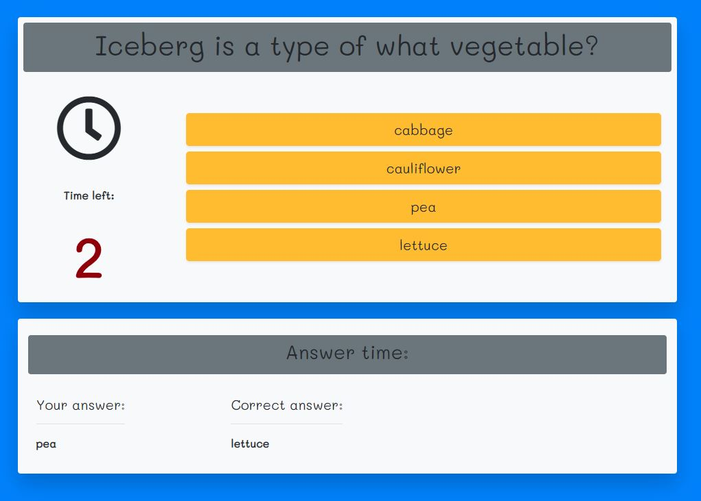
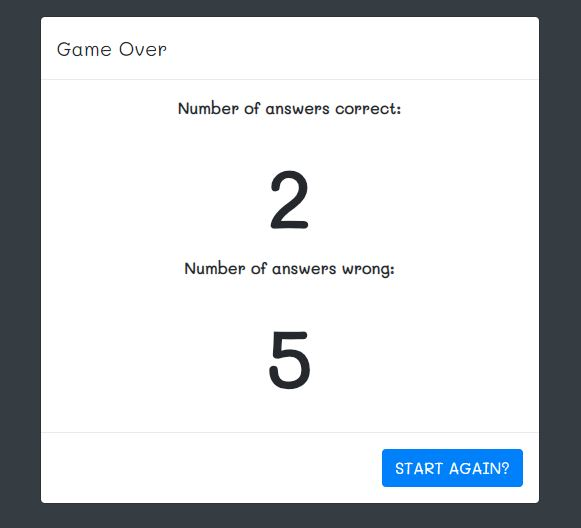

# TriviaGame
 A Trivia game using JavaScript for the logic and jQuery to manipulate HTML.
URL: https://winpildeu.github.io/TriviaGame/

## How to play:

### 1. Press the start button

### 2. Within the time limit, read the question and click the button of the correct answer. 
If not, the answer will show autmatically to the user for 5 sec.

#### ANSWER SECTION

### 3. After all the questions are finished, it will show the number of correct and incorrect answers.
Then you can choose to play the game again.

